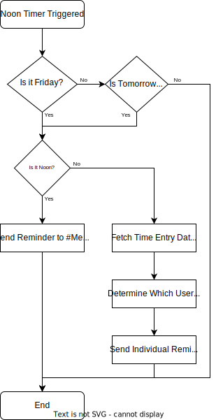

# Memento Bot

**This is an Azure Function designed to provide bot capabilities for Slack to integrate with Memento**

-----

## What does this bot do?

The primary purpose of this job is to save managers some time and assist billing by:

- Sending weekly reminders to the `#memento` channel to remind everyone to fill out their timesheets.
- Accessing Memento to determine if people have filled out their timesheets.
- Sending IMs to everyone who has forgotten

---

## How does this bot work?

This bot runs as an Azure Function with two timed triggers that run at 1200 and 1600 every day. 

The app then follows this high-level control flow:

Integration with Memento is provided through the [Memento API](https://memento.codurance.com/api-docs).

Integration with Slack makes use of the [Inumedia Slack API](https://github.com/Inumedia/SlackAPI) package.

---

## Where is this bot hosted?

The bot is hosted [here](https://portal.azure.com/#@codurance.com/resource/subscriptions/edb907a0-34b8-47cc-a65b-9ae69c0b6398/resourcegroups/memento-bot/providers/microsoft.web/sites/memento-bot/appServices). 

You'll need access to the Codurance tenant.